

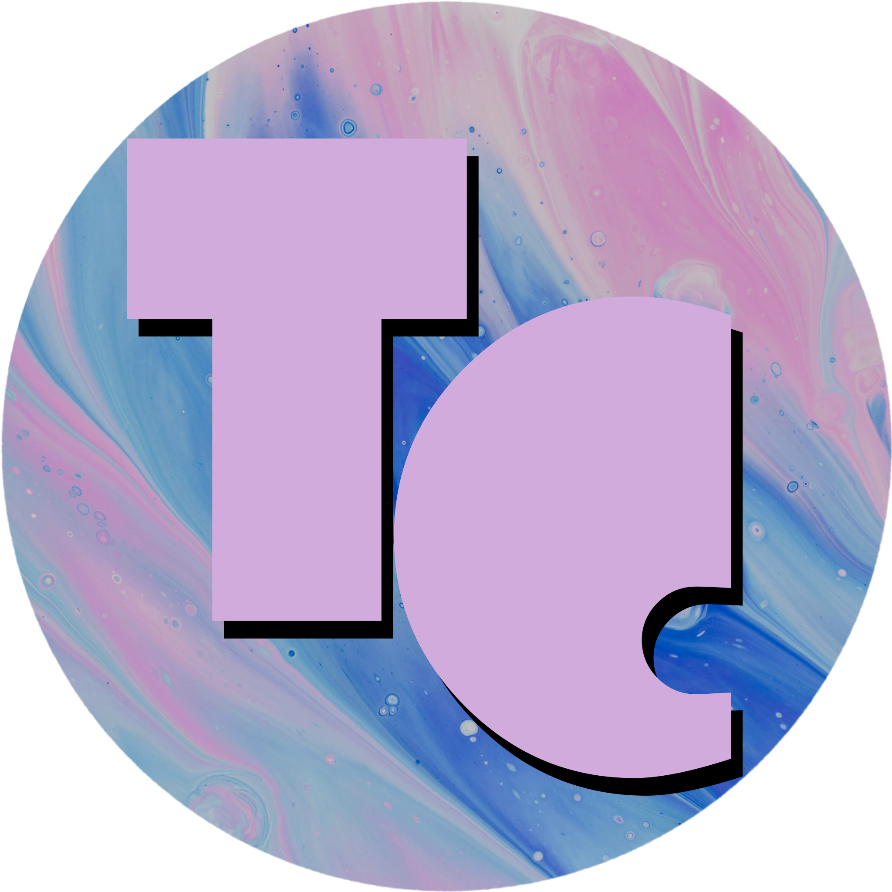

# 🍬 Tab Candy 🍬

**A customizable new tab screen and tab navigation utilities for [Obsidian](https://obsidian.md) — backgrounds, quotes, search, better tab cycling, and more.**

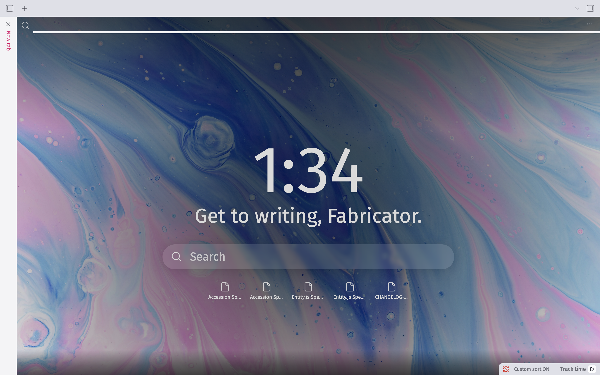

## What is this?

Tab Candy turns Obsidian's blank new-tab screen into something worth looking at: a background image, the time, a greeting, quick search, your recent files, your bookmarks, and a quote, all in one customizable view. And now with a host of tab navigation utilities included, Tab Candy has a little bit of sugar for everyone.

Some background: Tab Candy is an **evolution** of [Beautitab](https://github.com/andrewmcgivery/obsidian-beautitab) — not a continuation of it. Tab Candy started as a fork, but the codebase has since been rebuilt from the ground up: modernized against the current Obsidian API, made to work properly on both desktop and mobile, backed by an actual automated test suite, and given a CI pipeline that gates every change. What you're looking at today shares Beautitab's spirit and its original idea, but very little of its original code.

> [!NOTE]
> **A word of thanks.** None of this exists without Andrew McGivery's original work on Beautitab — the concept, the settings-first design philosophy, the whole idea of what a "pretty new tab" could be for Obsidian. Building something fun enough that someone else wants to keep it alive for years afterward is its own kind of success. Thank you for making Tab Candy possible in the first place. 🙏

## Features

Tab Candy's settings are split across two pages — **Function** (behavior: search, time, greeting, recent files, bookmarks, quotes) and **Design** (background and style) — to keep things easy to find as the settings list grows.

### Open automatically on new tabs

By default, opening a new empty tab in Obsidian shows Tab Candy automatically. If you'd rather trigger it manually instead, that's a setting too — either way, the **Open new tab** command in the command palette always works.

  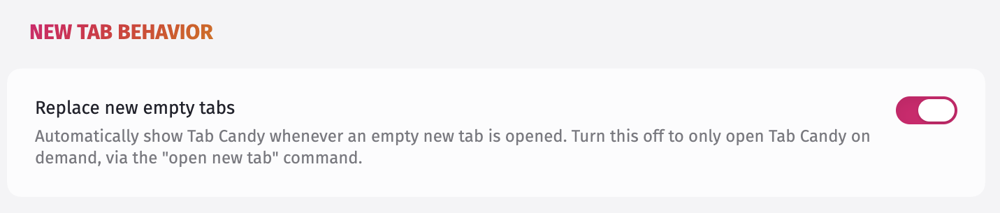

### Background

A background image fills the screen behind everything else. It stays the same for the rest of the day (or until Obsidian restarts), and you can choose where it comes from:

- **Local** — a folder in your vault, synced automatically; add individual images one at a time if you'd rather not sync a whole folder.
- **Custom** — a single image URL you provide yourself.
- **Transparent** / **Transparent with shadows** — let your current Obsidian theme's own background show through instead.

  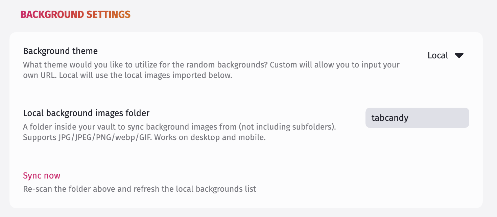

### Search

Two independent search entry points — a small icon in the top-left corner, and a larger inline search box in the center of the screen. Each can be shown or hidden on its own, and each can be configured to trigger a different command: Obsidian's built-in Quick Switcher by default, or a command from any other plugin you have enabled.

> [!TIP]
> Want a specific plugin supported as a search provider that isn't showing up? [Open an issue](../../issues) or [start a discussion](../../discussions).

  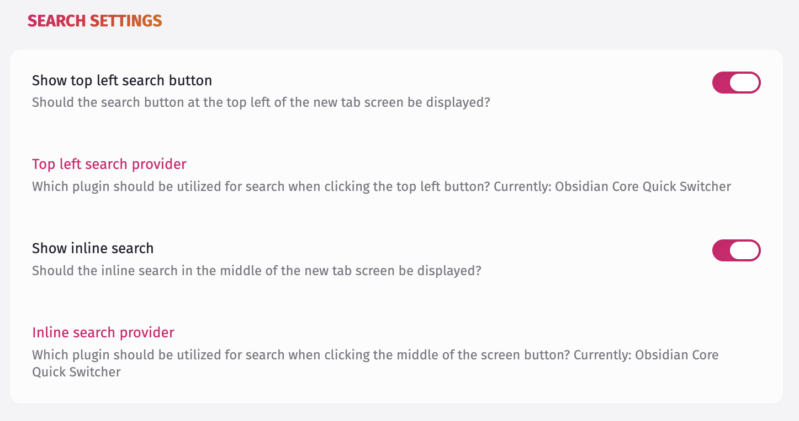

### Time & greeting

The current time (12-hour or 24-hour) and a customizable greeting, shown front and center. Either can be hidden independently.

  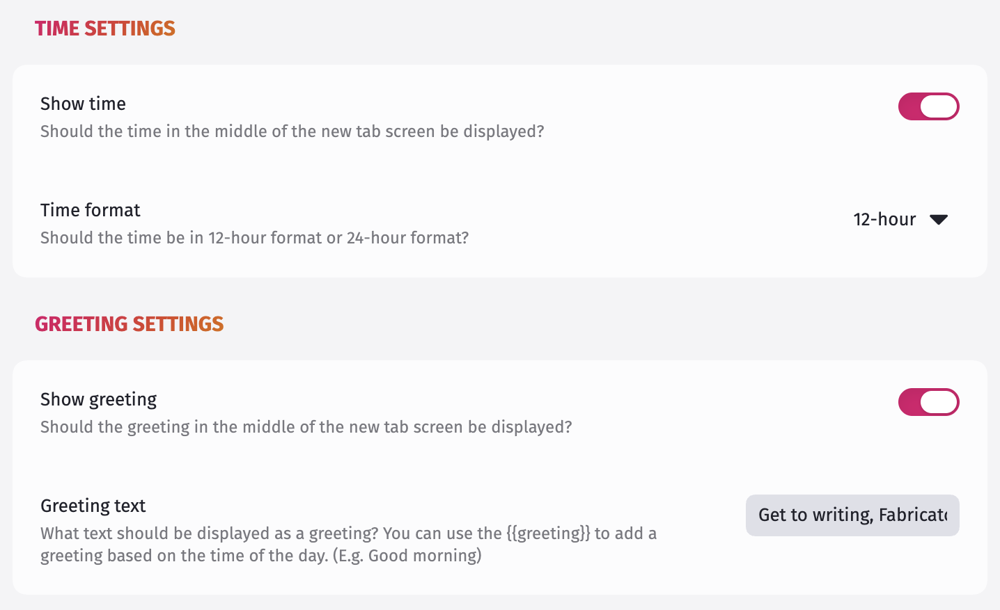

### Recent files

Your 5 most recently edited files, one click away.

  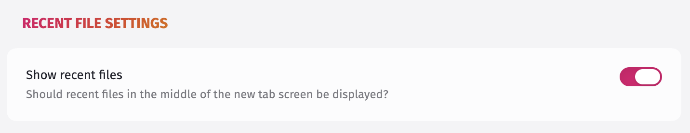

### Bookmarks

5 bookmarks, pulled either from your entire Bookmarks list or from one specific bookmark group you choose.

  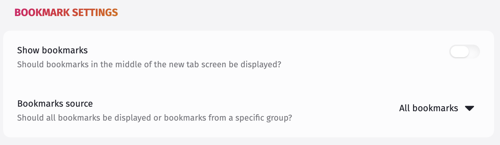

### Quote

A quote at the bottom of the screen, picked at random from your own list of custom quotes.

  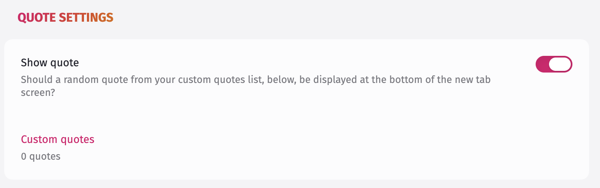

### Style customization

Tab Candy's colors can be customized through the [Style Settings](https://github.com/community-archive/obsidian-style-settings) community plugin. Install it, and a Tab Candy section appears in its settings pane with color pickers for the tab bar. If you don't have Style Settings installed, Tab Candy looks exactly as it always has — nothing to configure, nothing missing.

### Auto-contrast overlay text

When you're using a Local or Custom background image, Tab Candy can pick its overlay text color automatically from that image's own dominant color, contrast-adjusted for legibility, instead of a single fixed tone. Turn it on from the **Design** page in Tab Candy's settings.

## Navigation

Beyond the new tab screen itself, Tab Candy adds a handful of commands and settings for general tabs management. Commands are available from the command palette; bind your hotkeys under **Settings → Hotkeys** to add them your workflows.

> [!NOTE]
> Some of these features overlap with a number of plugins, which will be listed at the end of this section.

### Closing tabs

- **Close duplicate tabs** — if the same note is open in more than one tab, closes the extras and keeps one.
- **Close all tabs except this one**.
- **Close tabs in folder…** — pick a folder, and every tab showing a note inside it closes. Whether or not this reaches into subfolders is a toggle on the **Function** page, under **Workspace**.

None of the three ever close a pinned tab.

### Reopening tabs

- **Reopen closed tab** re-opens your most recently closed tab.
- Turn on **Show recently closed tabs** (Function page) to also see a short list of recently closed tabs right on the new tab screen — click one to reopen it.

### Moving between tabs

- **Search open tabs** — a quick fuzzy-search list of every open tab, for jumping straight to one by name instead of clicking through the tab bar.
- **Go to next/previous tab across groups** — cycles through every open tab, across every tab group, wrapping back to the start once it reaches the end. Unlike Obsidian's own tab-cycling shortcuts, it isn't limited to the current group.

### Stacked tab panes

If you use Obsidian's stacked tabs, **Widen stacked tab panes** (Function page, under **Workspace**) makes the open pane fill the available width instead of the narrower default Obsidian ships with. With the [Style Settings](https://github.com/community-archive/obsidian-style-settings) plugin installed, a slider under Style Settings → Tab Candy lets you pick a width between 40% and 100% instead of always going full width.

> [!NOTE]
> If you already use a CSS snippet that sets `--tab-stacked-pane-width` yourself, this setting and your snippet are touching the same property — whichever one Obsidian happens to load later wins. If you're content with your snippet, leave this feature turned off. If you want access to the slider in Style Settings, to customize the width, turn your snippet off and turn this feature on. You will need the [Style Settings plugin](https://community.obsidian.md/plugins/obsidian-style-settings) to use the slider.

> [!IMPORTANT]
> Separately, some versions of Obsidian don't immediately size a newly-opened stacked pane to the full width, even once this setting (or a plain snippet doing the same thing) is on — dragging the pane's border applies it. This is Obsidian's own stacked-tab layout behavior, not something Tab Candy controls.

### Switch to notes that are already open

Normally, clicking a note in Recent Files, Bookmarks, or the recently closed tabs list opens it in the current tab, even if that note is already open somewhere else. Turn on **Switch to notes that are already open** (Function page, under **New tab behavior**) to switch to the existing tab instead of opening a second copy.

### Plugins with similar features

This table lists other plugins that provide some of the included features. If you need specific behavior and not all the bells and whistles Tab Candy provides, one of these plugins may be a better fit.

I do not endorse or recommend these plugins, as I have not used them myself. I mention them as alternatives to help you decide how best to augment your Obsidian experience. Do your due diligence before installing and enabling any plugins, including Tab Candy.

| Feature | Plugin |
| ------- | ------ |
| Protecting pinned notes from being closed | [Pin Tab Guard](https://community.obsidian.md/plugins/pin-tab-guard) or [Real Pin](https://community.obsidian.md/plugins/real-pin) |
| Close duplicate tabs                      | [Tab Navigator](https://community.obsidian.md/plugins/tab-navigator)                                                               |
| Fuzzy search open tabs                    | [Tab Navigator](https://community.obsidian.md/plugins/tab-navigator)                                                               |
| Cycle through open tabs                   | [Tab Switcher](https://community.obsidian.md/plugins/cycle-through-panes)                                                          |

## Installation

### Via Community Plugins (recommended)

In the Community Plugins tab under Obsidian settings, search for "Tab Candy". Install and enable, et voila!

### Via BRAT

Pre-releases will occasionally arise. If you want to be on the bleeding edge of new features and desire to contribute feedback to help improve Tab Candy, you can install Tab Candy through BRAT:

1. Install the [BRAT](https://github.com/TfTHacker/obsidian42-brat) plugin from Obsidian's community plugin browser, if you don't already have it.
2. In BRAT's settings, choose **Add beta plugin** and enter this repository's URL.
3. Enable Tab Candy under **Settings → Community plugins**.

BRAT will also keep you on the latest release, betas included, if you opt into pre-releases in its settings.

### Manually

1. Download `main.js`, `manifest.json`, and `styles.css` from the [latest release](../../releases/latest).
2. Create a folder named `tabcandy` inside your vault's `.obsidian/plugins/` directory, and place the three files there.
3. Reload Obsidian, then enable Tab Candy under **Settings → Community plugins**.

## Screenshots

<table>
  <tr>
    <td>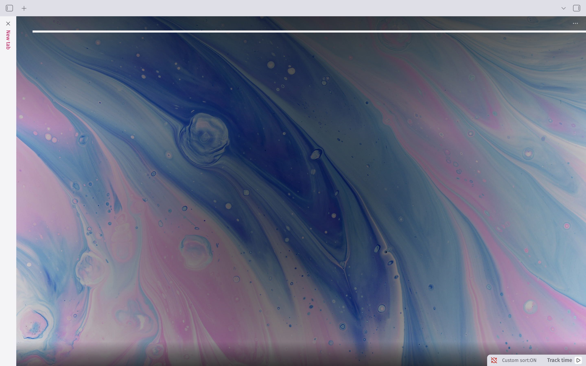</td>
    <td></td>
  </tr>
  <tr>
    <td>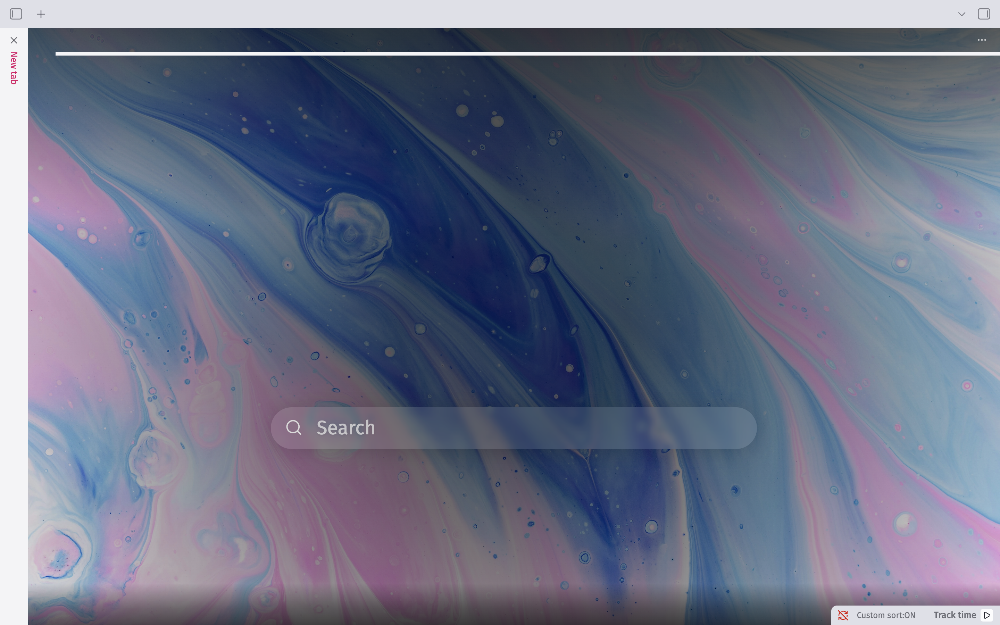</td>
    <td>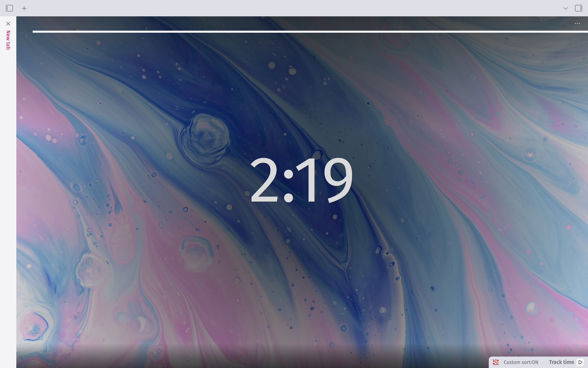</td>
  </tr>
  <tr>
    <td>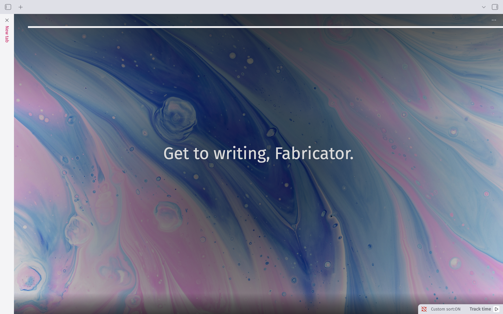</td>
    <td></td>
  </tr>
  <tr>
    <td></td>
    <td></td>
  </tr>
</table>

## Reporting issues

Found a bug? [Open an issue](https://github.com/lvnacy-notes/tabcandy/issues) and include as much detail as you can — what you expected, what happened instead, and a screenshot if it's visual. The more context, the faster it gets fixed. Please review existing issues before submitting a new one to avoid duplication.

## Contributing

Tab Candy is not accepting PRs at this time. Please report bugs or submit feature requests by raising an issue or starting a discussion. If Tab Candy opens up to PRs in the future, guidance for contributing to the project can be found in [CONTRIBUTING.md](./CONTRIBUTING.md).

## Credits

- Originally inspired by the Chrome extension [Momentum](https://momentumdash.com/).
- Built on the foundation laid by [Beautitab](https://github.com/andrewmcgivery/obsidian-beautitab) — see the note up top.

## Support

If Tab Candy's made your new tab screen a little nicer to look at, you can [buy me a coffee](https://ko-fi.com/lvnacy_).